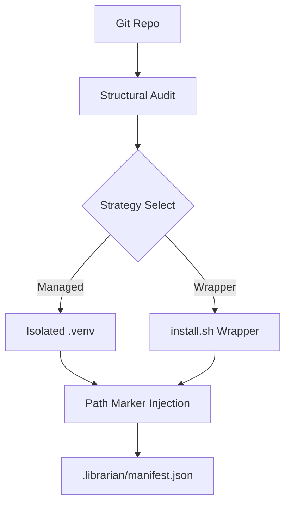

# Features & Capabilities: The Activator (repo-mcp-packager)

**Universal Deployment & Environment Isolation for the Workforce Nexus.**

The Activator is the primary engine for transforming repositories into production-ready AI tools while maintaining a "Clean Room" policy. This document provides a high-density reference for installation strategies, isolation logic, and the Phase 9 hardening suite.

---

## 📊 Installation Strategy Matrix

| Strategy | Mode | Reliability | Environment | Use Case |
| :--- | :--- | :---: | :--- | :--- |
| **Full Install** | Interactive | **High** | Managed `.venv` | Complex Python/Node projects |
| **Lightweight** | `--lite` | **Basic** | Shell Shim (`.sh`) | Single-file scripts / Portability |
| **Permanent** | `--permanent`| **Industrial** | Nexus Infra | Mission-critical deployments |
| **Headless** | `--headless` | **Automated**| Non-interactive | CI/CD / AI Agent replication |

---

## 📋 Table of Contents
1. [Clean Room Architecture](#clean-room-architecture)
2. [Command Matrix](#command-matrix)
3. [Intelligent Resolution & Hardening](#intelligent-resolution--hardening)
4. [Surgical Reversal (Uninstall)](#surgical-reversal-uninstall)

---

## 🔍 Clean Room Architecture

The Activator ensures that no tool pollutes the global host system by strictly gating environment variables and binaries.

---

## 💻 Command Matrix (Lookup)

| Operation | Command | Primary Flag | Context |
| :--- | :--- | :--- | :--- |
| **Install** | `python install.py` | (None) | Standard interactive deployment |
| **Update** | `python install.py` | `--update` | Pull code + re-harden permissions |
| **Bridge** | `python install.py` | `--generate-bridge` | Wrap legacy code for AI use |
| **Library** | `python install.py` | `--with-library` | Deploy Librarian alongside repo |
| **Rollback** | (Automatic) | (None) | Triggered on installation failure |

---

## 🔐 Intelligent Resolution & Hardening (Phase 9)

The Activator features a multi-layer safety suite to ensure executables "Just Work" on the first try:

1.  **Entry Point Resolution**: If a folder contains both `.py` and `.sh` entry points, the Activator prompts the user (or recommends the portable `.sh` option).
2.  **Auto-Chmod Enforcement**: Automatically sets the execute bit (`chmod +x`) on:
    *   Internal Nexus tools (`mcp.py`, `bootstrap.py`, etc.).
    *   Discovered user scripts in target repositories.
    *   Generated `install.sh` wrappers.
3.  **Permissions Audit**: During updates, the Activator re-verifies that all mapped executables are still granted appropriate permissions.

---

## 🗑️ Surgical Reversal (Uninstall)

The `uninstall.py` tool uses the **Nexus Manifest Layer** to ensure zero-residue cleanup:
*   **Artifact Removal**: Only files listed in `manifest.json` are deleted.
*   **PATH Cleaning**: Uses `# Nexus Block` markers for safe reversal (legacy installs may still contain `# Shesha Block`).
*   **Nexus Protection**: Refuses to delete the `~/.mcp-tools` home unless it is completely empty or the `--force` flag is used.

---

> **Author**: l00p3rl00p / Workforce Nexus
> **Reference**: [NEXUS_TECHNICAL_SPEC.md](./NEXUS_TECHNICAL_SPEC.md)

## 🏢 The Nexus Convergence Model
The Activator supports three tiers of organizational binding:

| Feature | Lite (Loose Binding) | Standard (Close Binding) | Industrial (Managed App) |
| :--- | :--- | :--- | :--- |
| **Logic Area** | Repos remain in workspace | `~/.mcp-tools/suite` (Symlinks) | `~/.mcp-tools/app` (Managed) |
| **Environment** | OS-Default / Manual | Per-module venvs | Unified Hardened Venv |
| **Update Path** | Manual per repo | Live (via Symlinks) | On-Demand (`nexus-sync`) |

---

## 📚 Master Documentation
For the complete suite experience and detailed procedures, see:
👉 **[NEXUS_GUIDE.md](./NEXUS_GUIDE.md)**

---

> **Author**: l00p3rl00p / Workforce Nexus
> **Reference**: [ARCHITECTURE.md](./ARCHITECTURE.md) | [ENVIRONMENT.md](./ENVIRONMENT.md)
