# Workforce Nexus: Technical Specification & Release Guide

The **Workforce Nexus** is a mission-critical infrastructure suite for AI-assisted development. This document provides a low-density reference for all features, reliability tiers, and operational flows.

---

## ⚡ Quick Reference: The Reliability Matrix

| Feature | Basic | High | Industrial |
| :--- | :---: | :---: | :---: |
| **Philosophy** | Portable Utility | Power-Tool | Infrastructure |
| **Dependencies** | Zero-Dep | Pure Python | Managed Venv |
| **Indexing** | Basic Glob | Regex-based | `pathspec` (True Git) |
| **Validation** | Basic Type | Structural Audit | `jsonschema` (IDE Spec) |
| **Integrity** | N/A | SHA-256 Manifest | Ongoing Verification |
| **Rollback** | Atomic Cleanup | Atomic Cleanup | State Restoration |

---

## 📋 Table of Contents
1. [System Architecture](#system-architecture)
2. [Reliability Tiers Deep Dive](#reliability-tiers-deep-dive)
3. [Universal Safety Protocol](#universal-safety-protocol)
4. [Component Directory](#component-directory)
5. [Operational Flowcharts](#operational-flowcharts)
6. [Troubleshooting & Support](#troubleshooting--support)

---

## 🔍 System Architecture

The Nexus centralizes all management tools into a shared, hidden directory while maintaining project-level isolation.

---

## 🌟 Reliability Tiers Deep Dive

### 1. Lite Tier (`--lite`)
*   **Target**: One-off environments, cloud shells, or when storage is critical.
*   **Logic**: Uses only Python standard libraries.
*   **Constraint**: Simple glob matching may occasionally miss complex `.gitignore` negation patterns.

### 2. Standard Tier (Default)
*   **Target**: Most professional development workflows.
*   **Logic**: Pure Python enhancements.
*   **Key Feature**: **Structural Auditing**. Before writing to an IDE config, the tool detects if the underlying schema has changed to prevent data loss.

### 3. Permanent Tier (`--permanent`)
*   **Target**: Mission-critical workspaces and long-term infrastructure.
*   **Logic**: Installs peer-reviewed, industry-standard libraries into a private venv.
*   **Key Feature**: **100% Git Compliance**. Uses `pathspec` to ensure the Librarian sees exactly what your Git client sees.

---

## 🔐 Universal Safety Protocol
Every installation action follows a strict "Survive or Revert" pattern.

```mermaid
flowchart TD
    Start[Trigger Action] --> PreFlight[Pre-flight Check]
    PreFlight -- Success --> Track[Track Artifacts]
    PreFlight -- Fail --> Error[Bail & Log]
    
    Track --> Install[Perform Action]
    Install -- Success --> Commit[Lock Manifest]
    Install -- Fail --> Rollback[Atomic Rollback]
    
    Rollback --> Removed[System Clean]
    Commit --> Done[✅ Success]
```

---

## 🛠 Component Directory

### **The Surgeon (`mcp-injector`)**
*   **Goal**: Inject MCP server definitions into IDE configs.
*   **Options**: `--add`, `--remove`, `--list-clients`.
*   **Safety**: Validates JSON syntax and structure before saving.

### **The Observer (`mcp-server-manager`)**
*   **Goal**: Health monitoring and log ingestion.
*   **Options**: Start/Stop servers, view unified logs.
*   **Safety**: Read-only log access; never modifies your source code.

### **The Librarian (`mcp-link-library`)**
*   **Goal**: Bridge legacy code to the AI Context.
*   **Options**: Web scraping, PDF extraction, local indexing.
*   **Safety**: Process-isolated scraping; resource-limited indexing.

---

## ⚙️ Advanced Recovery Ops

If the Nexus becomes unaligned:
1.  **Verify Integrity**: `python bootstrap.py --verify` (Uses SHA-256).
2.  **Forced Rebuild**: `python bootstrap.py --permanent --force`.
3.  **Atomic Purge**: `python uninstall.py --purge-data`.

---

## 📝 Troubleshooting

| Symptom | Cause | Resolution |
| :--- | :--- | :--- |
| **Index Misses Files** | `.gitignore` too restrictive | Use `Industrial` tier for 100% pattern matching. |
| **Config Rejected** | Structural Drift | Manual IDE update detected. Run with `--force` or update the Surgeon. |
| **Venv Missing** | Install interrupted | Re-run `bootstrap.py --permanent`. |

---

> **Note**: This document adheres to the [MD_FORMAT.md](https://keepachangelog.com/) standards.
