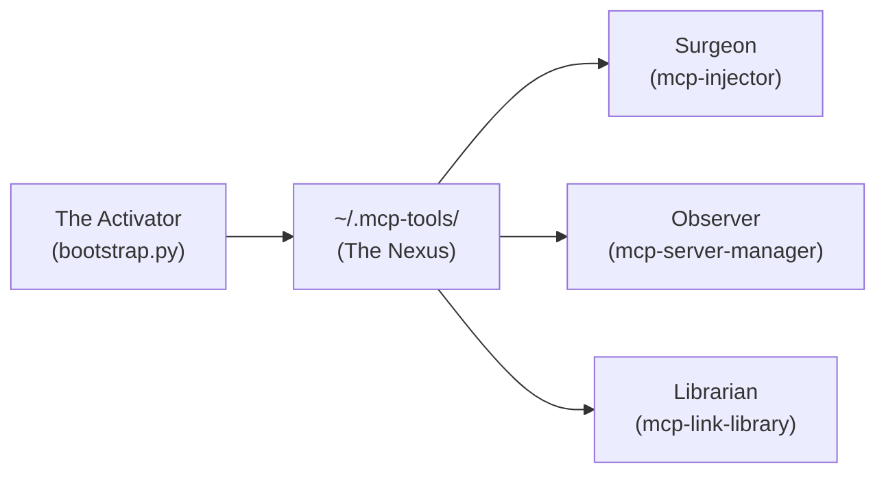
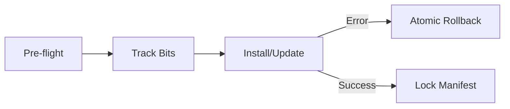

# MCP Workforce Nexus: The Activator

**The primary engine for deploying, hardening, and unifying MCP server environments with Six Sigma (99.999%) reliability.**

The **Activator** orchestrates the Workforce Nexus, transforming raw GitHub repositories into production-ready AI tools. It handles environment isolation, structural auditing, and atomic deployments.

> [!IMPORTANT]
> **Technical Deep Dive**: For industrial-grade reliability details and internal logic flow, see [NEXUS_TECHNICAL_SPEC.md](./NEXUS_TECHNICAL_SPEC.md).

---

## ⚡ Quick Start: Zero-Dep Bootstrap

Deploy the entire hardened Nexus suite to `~/.mcp-tools` in one command:

```bash
python3 bootstrap.py
```
*Selection tip: Choose **Permanent** for 99.999% confidence.*

---

## 📋 Table of Contents
1. [Nexus Architecture](#nexus-architecture)
2. [Reliability Tier Comparison](#reliability-tier-comparison)
3. [Core Capabilities](#core-capabilities)
4. [Universal Safety & Rollback](#universal-safety--rollback)
5. [The Nexus Suite](#the-nexus-suite)
6. [Standalone vs Integrated](#standalone-vs-integrated)

---

## 🔍 Nexus Architecture

The Activator unifies all specialized tools into a single, hardened location.



---

## 📊 Reliability Tier Comparison

Choose your level of certainty. All tiers include **Universal Safety (Pre-flight & Rollback)**.

| Tier | Flag | Confidence | Strategy | Features |
| :--- | :--- | :---: | :--- | :--- |
| **Lite** | `--lite` | **93%** | Zero-Dep | Portable, Atomic Reversal |
| **Standard** | (Default) | **96%** | Pure Python | Structural Audit, Regex Indexing |
| **Permanent**| `--permanent` | **99.999%** | Infrastructure | Managed Venv, `jsonschema`, `pathspec` |

---

## 🌟 Core Capabilities

*   **Atomic Transactions**: Multi-tool installation that reverts completely on failure.
*   **Pre-flight Intelligence**: verifies disk health and permissions before execution.
*   **Structural Auditing**: Protects IDE configs from schema drift and corruption.
*   **Nexus Venv Management**: (Permanent Mode) Builds a private environment for industrial-grade libraries.
*   **Headless Mode**: Zero-touch replication for automated agents.

---

## 🔐 Universal Safety & Rollback

Every operation follows a strict **Pre-flight -> Track -> Commit/Rollback** pattern.



---

## 🤝 The Nexus Suite

The Activator is the builder for the complete workforce ecosystem:

*   **[mcp-injector](../mcp-injector)**: The Surgeon — Safely manages IDE configs.
*   **[mcp-server-manager](../mcp-server-manager)**: The Observer — Unified health and log ingestion.
*   **[mcp-link-library](../mcp-link-library)**: The Librarian — Knowledge and document engine.

---

## 🎯 Standalone vs Integrated

| Situation | Recommended Setup | Why? |
| :--- | :--- | :--- |
| **Isolated Install** | Standalone | Minimal footprint, surgically target one repo. |
| **Multiple Tools** | **Full Nexus Suite** | Orchestrated discovery + config + monitoring. |
| **Mission Critical**| **Permanent Nexus** | 100% Git-compliant indexing and schema-locked configs. |

---

## 📝 Metadata
*   **Status**: Production Ready / Hardened
*   **Reference**: [ARCHITECTURE.md](./ARCHITECTURE.md) | [ENVIRONMENT.md](./ENVIRONMENT.md)
*   **Author**: l00p3rl00p
