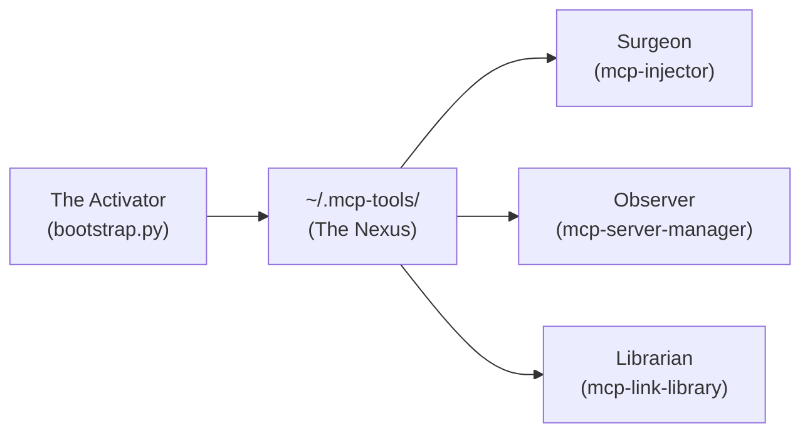
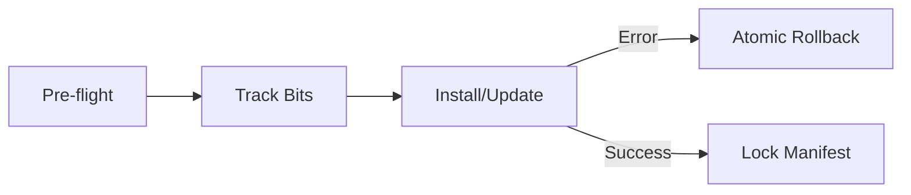

# MCP Workforce Nexus: The Activator

**The primary engine for deploying, hardening, and unifying MCP server environments with industrial-grade reliability.**

The **Activator** orchestrates the Workforce Nexus, transforming raw GitHub repositories into production-ready AI tools. It handles environment isolation, structural auditing, and atomic deployments.

---

## ⚡ Quick Start: Standalone Activator

Install a single repository as a portable MCP server immediately:

```bash
python3 serverinstaller/install.py
```
*Selection tip: Follow the prompts to detect Python/Node and generate an `install.sh` shim.*

---

## 🚀 Package Start: The Workforce Nexus

Deploy the entire hardened Nexus suite to `~/.mcp-tools` in one command:

```bash
python3 bootstrap.py --gui
```
*Selection tip: Use `--gui` to auto-launch the dashboard after installation.*

---

## 📋 Table of Contents
1. [Nexus Architecture](#nexus-architecture)
2. [Reliability Tier Comparison](#reliability-tier-comparison)
3. [Core Capabilities](#core-capabilities)
4. [Universal Safety & Rollback](#universal-safety--rollback)
5. [Documentation (Low Density)](#documentation-low-density)

---

## 🔍 Nexus Architecture

The Activator unifies all specialized tools into a single, hardened location.



---

## 📊 Reliability Tier Comparison

All tiers include **Universal Safety (Pre-flight & Rollback)**.

| Tier | Flag | Convergence Area | Strategy | Features |
| :--- | :--- | :---: | :--- | :--- |
| **Lite** | `--lite` | **Distributed** | Zero-Dep | Portable, Atomic Reversal, Auto-Chmod |
| **Standard** | (Default) | **Linked** | Pure Python | Structural Audit, Regex Indexing, Symlinks |
| **Industrial** | `--industrial` | **Unified** | Infrastructure | Managed Venv, `jsonschema`, `pathspec` |

---

## 🌟 Core Capabilities

*   **Atomic Transactions**: Multi-tool installation that reverts completely on failure.
*   **Suite Synergy**: Detects sibling tools and triggers "Application Convergence" for a unified experience.
*   **Intelligent Resolution**: Prompt/Recommend between multiple entry points (e.g., `.sh` vs `.py`).
*   **Auto-Chmod Enforcement**: Automatically sets execute bits on all entry points and dependencies.
*   **Pre-flight Intelligence**: Verifies disk health and permissions before execution.
*   **Headless Mode**: Zero-touch replication for automated agents.

---

## 🔐 Universal Safety & Rollback

Every operation follows a strict **Pre-flight -> Track -> Commit/Rollback** pattern.



---

## 📚 Documentation (Low Density Deep Dives)

Detailed technical manuals for engineering reference:

*   **[ARCHITECTURE.md](./ARCHITECTURE.md)**: Logic models, subsystems, and state machines.
*   **[ENVIRONMENT.md](./ENVIRONMENT.md)**: Audit logic, OS-specific paths, and dependency rules.
*   **[FEATURES.md](./FEATURES.md)**: Command matrix, resolve logic, and scorable feature logs.
*   **[NEXUS_TECHNICAL_SPEC.md](./NEXUS_TECHNICAL_SPEC.md)**: Master reliability specification.


## 🖥️ Launching the Dashboard

For a visual overview of your Nexus, use the provided helper script or CLI command:

```bash
./start_gui.sh
# OR
python3 -m mcp_inventory.cli gui
```

Open your browser to `http://localhost:8501`.

---

# Application Convergence & Synergy
The "Nexus Application" mode is triggered when the bootstrapper detects all four modules (mcp-injector, mcp-link-library, mcp-server-manager, repo-mcp-packager) in the same workspace.

Convergence Matrix (Organization & Areas)
Feature	Lite (Loose Binding)	Standard (Close Binding)	Industrial (Managed App)
Philosophy	"Distributed & Portable"	"Cohesive & Linked"	"Monolithic & Hardened"
Logic Area	Repos remain in workspace	~/.mcp-tools/suite (Symlinks)	~/.mcp-tools/app (Managed Mirror)
Shared Base	~/.mcp-tools/lite/	~/.mcp-tools/standard/	~/.mcp-tools/industrial/
Environment	OS-Default / Manual Venv	Per-module local venvs	Single Unified Hardened Venv
Update Path	Manual per repo	Live (via Symlinks)	On-Demand (nexus-sync)
Global Path	Optional (Local first)	Recommended	Mandatory Enforcement


---

## 📝 Metadata
*   **Status**: Production Ready / Hardened (Phase 9)
*   **Author**: l00p3rl00p
*   **Workflow**: Adheres to `@/fix-md-files-for-release`
